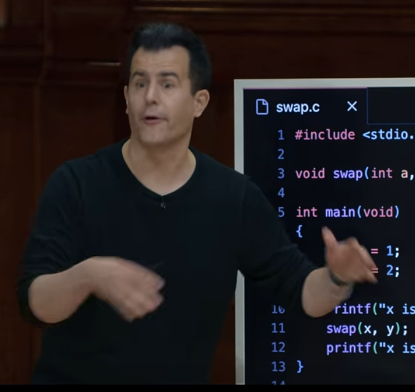
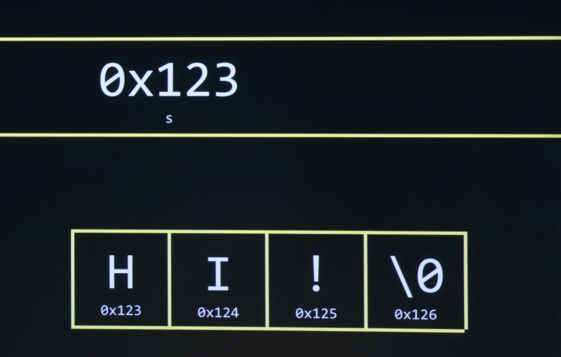
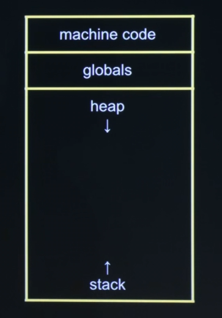
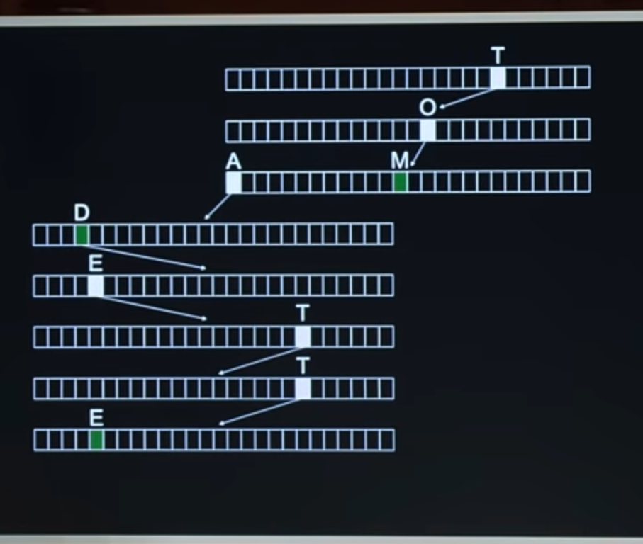
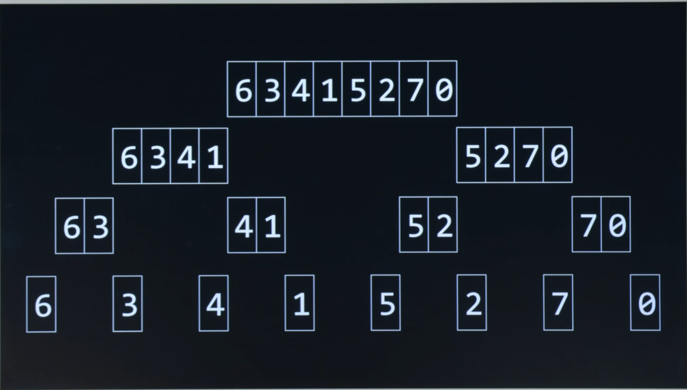

## Author
- **10XTMY**, [molmez.io](https://molmez.io), 2024

## License
This project is licensed under the MIT License - see the [LICENSE.md](LICENSE.md) file for details. 

It contains borrowed code from CS50's GitHub repository, available [here](https://github.com/cs50/libcs50).

# **C Programming Study Notes**

Coder notes on C programming inspired by CS50's 2024 Introduction to Computer Science course.



Presented by the amazing David J. Malan.

YouTube Playlist: 

https://www.youtube.com/watch?v=3LPJfIKxwWc&list=PLhQjrBD2T381WAHyx1pq-sBfykqMBI7V4&pp=iAQB

## Strings

* When using strings you must use double quotes. "Yes"
* When using characters you must use single quotes 'Y'
* Strings are arrays of characters
* Strings are null terminated
* Strings are actually pointers to the first character of the string:
* char *s = "Hello";
* The s is the address of the first character of the string
* The null terminator is a special character that is used to indicate the end of a string
* The null terminator is '\0'
* Comparing strings: strcmp(s1, s2) returns 0 if the strings are equal
* strcmp is defined in the string.h library
* You cannot use == to compare strings because it compares the addresses of the first characters of the strings



screenshot video source - https://www.youtube.com/watch?v=F9-yqoS7b8w

## Bytes

* A byte is 8 bits
* There is no built-in data type for bytes in C
* You can use uint8_t from the stdint.h library
* Example: typedef uint8_t BYTE;

## Garbage Values

* Uninitialized variables contain garbage values
* Always initialize variables before using them
* Example: int x = 0;
* Example: char s[5] = "Hello";
* Example: 
```c
int main(void) {
    int *x;    
    x = malloc(sizeof(int));
    *x = 42;
}
```
* int scores[1024] will contain 1024 garbage values!

## Pointers

* A variable that stores the address of another variable(syntax: int *p; usage: p = &x; get value: *p;)
* The & operator is used to get the address of a variable
* The * operator is used to get the value of a variable that a pointer is pointing to
* The * operator is also used to declare a pointer
* For arrays: the name of the array is a pointer to the first element of the array.
* (int *p = &arr[0]; is the same as int *p = arr;)

## Structs

* User-defined data type that groups related data together.
* Defined using the struct keyword.
* Can contain any number of members of any type.
* Memory Allocation: Each member within a struct has its own unique memory location.
* The total size of a struct is at least the sum of the sizes of its members (with potential padding for alignment).
* Example:
```c
struct Person {
    char name[50];
    int age;
    float salary;
} person;
```

## Unions

* User-defined data type that groups related data together.
* Memory Allocation: All members of a union share the same memory location.
* This shared memory is as big as the largest member, and there's no extra space allocated for other members.
* At any given time, a union can store a value for only one of its members.
* Usage: Unions are used when you want to store one of several types of data in the same memory location, which can be useful for memory management or when applying different interpretations to the same bytes.
* Example:
```c
union Data {
    int i;
    float f;
    char str[20];
} data;
```

## Key Differences Between Structs and Unions

### Memory Usage:

* Structs allocate separate memory for each of their members.
* Unions use a single shared memory space for all members.

### Purpose:
* Structs are meant for grouping different data items together, with each item accessed independently.
* Unions are used for storing one of several types of data in the same space, useful for saving memory or dealing with different representations of the same data.

## Command Line Arguments

* argc is the number of command line arguments.
* argv is an array of strings that contains the command line arguments.
* argv[0] is the name of the program.
* argv[1] is the first command line argument.
* argv[2] is the second command line argument.
* and so on.
* Example:
```c
int main(int argc, char *argv[]) {
    if (argc != 2) {
        printf("Usage: ./program_name argument\n");
        return 1;
    }
    printf("Hello, %s\n", argv[1]);
    return 0;
}
```

## Variadic Arguments/Functions

* A variadic function is a function that can take a variable number of arguments.
* Defined using the ellipsis (...) in the function prototype.
* Example:
```c
#include <stdio.h>
#include <stdarg.h>

// Function to calculate the sum of an indefinite number of integers
int sum(int count, ...) {
    int total = 0;
    va_list ap;
    va_start(ap, count); // Initialize va_list with the number of arguments

    for (int i = 0; i < count; i++) {
        total += va_arg(ap, int); // Retrieve the next integer argument
    }

    va_end(ap); // Clean up va_list
    return total;
}

int main() {
    printf("Sum of 2, 3, 5 is %d\n", sum(3, 2, 3, 5)); // Output: 10
    printf("Sum of 10, 20, 30, 40 is %d\n", sum(4, 10, 20, 30, 40)); // Output: 100
    return 0;
}


```

## Linked Lists

* Uses address pointers to link nodes together.
* Final node points to NULL(0x0).
* Example node struct:
```c
struct Node {
    int number;
    struct Node *next;
};
```

## Arrow Operator

* The arrow operator (->) is used to access the members of a struct or union through a pointer.
* This saves you having to type out the dereference operator (*) and the dot operator (.).
* So this: 
```c
*head.number = 1;
```
* is replaced with the arrow operator:
```c
Node *head = malloc(sizeof(Node));
head->number = 1;
```

## Stack and Heap Memory



screenshot video source - https://www.youtube.com/watch?v=F9-yqoS7b8w

### Stack:
* A region of memory that is used to store local variables and function call information.
* LIFO (last in, first out) data structure.

### Heap:
* A region of memory that is used to store dynamically allocated memory.
* Hierarchical data structure.

## Malloc, copying arrays

* malloc is a function that allocates memory on the heap.
* Returns a pointer to the allocated memory.
* Takes a single argument, the number of bytes to allocate.
* If malloc fails to allocate memory, it returns a null pointer.
* Defined in stdlib.h.
* Can be used to copy the contents of one array to another array by allocating memory for the new array and then copying the contents of the old array to the new array.
* Example (copying the contents of one array to another array):
```c
int *arr1 = malloc(5 * sizeof(int));
int *arr2 = malloc(5 * sizeof(int));
for (int i = 0; i < 5; i++) {
    arr1[i] = i;
}
for (int i = 0; i < 5; i++) {
    arr2[i] = arr1[i];
}
```
When accessing pointers that act as arrays, you do not use the * operator to access the value.
* *arr1[i] implies arr1[i] is a pointer, which would be used in a different context (e.g., if arr1 was an array of pointers).

## Copying Strings

* See **copy_string.c** for an example of using malloc to copy a string.
* strcpy is a function that copies a string from one location to another.
* Defined in string.h.

## Swap

* You can swap two values using a temporary variable.
* Example:
```c
void swap(int *a, int *b) {
    int temp = *a;
    *a = *b;
    *b = temp;
}
```

## Truncation

* Truncation occurs when a value is converted to a data type that cannot hold the value.
* To avoid truncation, you can type cast to float.
* Example, the values of x and y are type cast to float before being divided, so the result is a float.:
```c
int x = get_int("x: ");
int y = get_int("y: ");

float z = (float) x / (float) y;
printf("%.5f\n", z); // prints the result of x divided by y to 5 decimal places
```

## Floating Point Imprecision

* No floating point number can be represented exactly in binary.
* Pay attention to the precision of floating point numbers.

## Freeing Memory
* free() deallocates memory on the heap. 
* It takes a single argument, a pointer to the memory to deallocate. 
* Defined in stdlib.h.
* Use free to deallocate memory when you are done with it:
```c
free(arr1);
free(arr2);
```

## Integer Overflow

* Occurs when an integer is incremented past its maximum value and resets to its minimum value.
* Check for overflow before incrementing.
* If the minimum is negative then the total storage capacity halves, half used for negative numbers and the other half is used for positive numbers.
* With 32-bit integers, the maximum value is 2^31 - 1 and the minimum value is -2^31. Total of 4,294,967,295 values.
* If only positive numbers you have the entire range of 0 to 2^32 - 1.
* If only negative numbers you have the entire range of -2^31 to -1.
* If you have both positive and negative numbers then the range is -2^31 to 2^31 - 1.
* With 64-bit integers, the maximum value is 2^63 - 1 and the minimum value is -2^63. Total of 9,223,372,036,854,775,807 values.
* Why is the maximum value 2^31 - 1 and not 2^32? The first bit is used to indicate whether the number is positive or negative.

## Buffer Overflow

* Buffer overflow occurs when a program writes more data to a buffer than the buffer can hold.

## Segmentation Fault

* Segmentation fault occurs when a program tries to access unallocated memory
* Segmentation fault occurs when a program tries to access memory that it does not have permission to access.
* scanf is used for reading formatted input from the standard input stream.
* scanf is a common cause of segmentation faults, it does not allocate memory for the string it reads.
* Example using scanf:
```c
char *s;
scanf("%s", s);
```
* The above code will cause a segmentation fault because the pointer s is not initialized and does not point to any allocated memory.
```c
char s[4];
printf("s: ");
scanf("%s", s);
printf("s: %s\n", s);
```
* The above code will cause a segmentation fault if the user enters more than 3 characters because the buffer is not large enough to hold the input.

##### See the cs50 library for a safer implementation to scanf in get_string, get_int, get_float, etc.

## Memory Leaks

* A memory leak occurs when a program allocates memory on the heap and then loses the address of the memory before deallocating it.
* Memory leaks can cause a program to run out of memory and crash.

## Valgrind

* Valgrind is a profiling tool for detecting memory leaks and memory errors in C programs.
* website: https://www.valgrind.org/

## Asymptotic Notation (Big O, Big Omega, Big Theta)

By 'bound' we are referring to the time complexity of an algorithm. The time complexity of an algorithm is the amount of time it takes to execute an algorithm. The time complexity of an algorithm is the amount of time it takes to execute an algorithm as a function of the size of the input to the algorithm. The time complexity of an algorithm is the amount of time it takes to execute an algorithm.

### Big O
Big O notation is used to describe the upper bound of an algorithm. It is used to describe the worst case scenario of an algorithm. It is used to describe the upper limit of the growth of an algorithm. It is used to describe the maximum time an algorithm will take to execute.

### Big Omega
Big Omega notation is used to describe the lower bound of an algorithm. It is used to describe the best case scenario of an algorithm. It is used to describe the lower limit of the growth of an algorithm. It is used to describe the minimum time an algorithm will take to execute.

### Big Theta
Big Theta notation is used to describe the tight bound of an algorithm. It is used to describe the average case scenario of an algorithm. It is used to describe the average limit of the growth of an algorithm. It is used to describe the average time an algorithm will take to execute.

### Related Notations

Big O notation has a few related notions. If f,g are functions, then:

* f=O(g) (big-oh) if eventually f grows slower than some multiple of g;
* f=o(g) (little-oh) if eventually f grows slower than any multiple of g;
* f=Ω(g) (big-omega) if eventually f grows faster than some multiple of g;
* f=ω(g) (little-omega) if eventually f grows faster than any multiple of g;
* f=Θ(g) (theta) if eventually f grows at the same rate as g.

### levels of growth
1. O(1) - constant time
2. O(log n) - logarithmic time
3. O(n) - linear time
4. O(n log n) - linearithmic time
5. O(n^2) - quadratic time
6. O(n^3) - cubic time
7. O(a^n) - exponential time
8. O(n!) - factorial time

.png)

screenshot video source - https://www.youtube.com/watch?v=3LPJfIKxwWc

## Hash Tables

Hashing data takes any kind of data and converts it into a fixed size value that is used as an index in an amalgam of 
arrays and linked lists.

If we have a hash function that has no collisions we can achieve close to O(1) time complexity.

### Tries

* Also known as a prefix tree, is a specialized tree-like data structure that facilitates the storage and 
retrieval of strings in a dataset. 
* Particularly efficient for operations like searching for a string, prefix matching, and implementing features like autocomplete. 
* Each node in a trie represents a single character of a string
* The path from the root to a node represents a prefix of some strings stored in the trie.
* Space complexity: O(n * m), where n is the number of strings and m is the length of the longest string.
* While tries can consume more space than some other data structures due to their tree-like nature and the need for 
* nodes for each character in the set of stored strings, the actual space required is proportional to the sum of the lengths of all stored strings. 
* Space optimization techniques, such as compressed tries or using hash maps instead of fixed-size arrays for child nodes, can mitigate the space concerns.
* Time complexity: O(m), where m is the length of the string to be searched.
* Powerful and efficient way to manage collections of strings for certain types of queries and operations. 
* While they can be more space-intensive than some other data structures, their benefits for specific applications like prefix searches and autocomplete functionalities often outweigh the potential drawbacks. 
* The space and time complexity of tries make them suitable for applications where quick retrieval, insertion, and deletion of string data are critical, and the data set contains many shared prefixes.



screenshot video source - https://www.youtube.com/watch?v=F9-yqoS7b8w

## Sorting Algorithms

Merge sort and quick sort are two of the most efficient sorting algorithms.

Divide and Conquer:



screenshot video source - https://www.youtube.com/watch?v=jZzyERW7h1A

### Merge Sort
#### Time complexity: O(nlogn) best/average/worst case
#### Space complexity: O(n)

* Divides the input array into two halves, calls itself for the two halves, and then merges the two sorted halves by comparison.
* Stable, meaning that it preserves the order of equal elements in the sorted output.
* Not in-place, meaning that it require extra space proportional to the size of the input array.
* main drawback is its O(n) additional space complexity, making it less suitable for memory-constrained environments. 
* Example of merge sort in **merge_sort.c**

### Quick Sort
#### Time complexity: O(nlogn) best/average, O(n^2) worst case
#### Space complexity: O(logn) best, O(n) average, O(n) worst case

* Picks an element as a pivot and partitions the given array around the picked pivot.
* Not Stable, meaning that it does not preserve the order of equal elements in the sorted output.
* In-place, meaning that it does not require extra space and the memory is constant.
* Often faster in practice than other O(nlogn) algorithms like merge sort, especially for small to medium-sized arrays. 
* It has a smaller constant factor, and its in-place version has a lower space complexity.
* Example of quick sort in **quick_sort.c**

## File I/O

* Reading from a source file and writing to a destination file:
```c
#include <stdio.h>
#include <stdint.h>

typedef uint8_t BYTE;

void main(int argc, char *argv[]) {
    FILE *src = fopen(argv[1], "rb");
    FILE *dst = fopen(argv[2], "wb");
    
    BYTE b;
    while (fread(&b, sizeof(BYTE), 1, src)) {
        fwrite(&b, sizeof(BYTE), 1, dst);
    }
    
    fclose(src);
    fclose(dst);
}
```